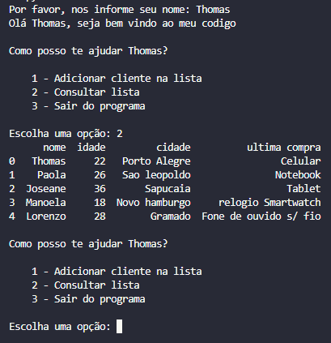

# Cadastro de clientes com Pandas 📊

Sobre o projeto:
Desenvolvi este projeto com o objetivo de praticar a manipulação de dados utilizando a linguagem Python e a biblioteca Pandas, por meio de um sistema simples de cadastro de clientes executado no terminal.

## Tecnologias utilizadas 🛠️
- Python
- Pandas
- Visual Studio Code

## Funcionalidades ⚙️
- Cadastro de novos clientes
- Consulta da lista de clientes
- Armazenamento dos dados em um DataFrame utilizando Pandas
- Menu interativo no terminal
- Manipulação de dados em memória

## Demonstração 📷

